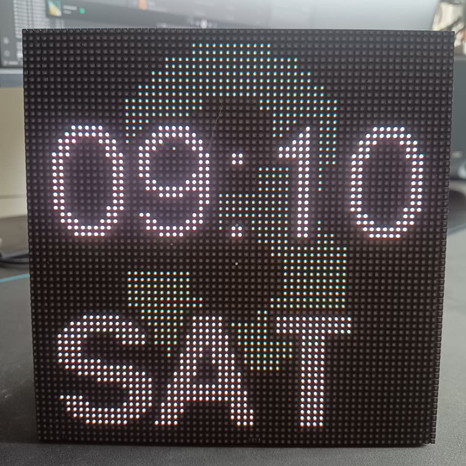
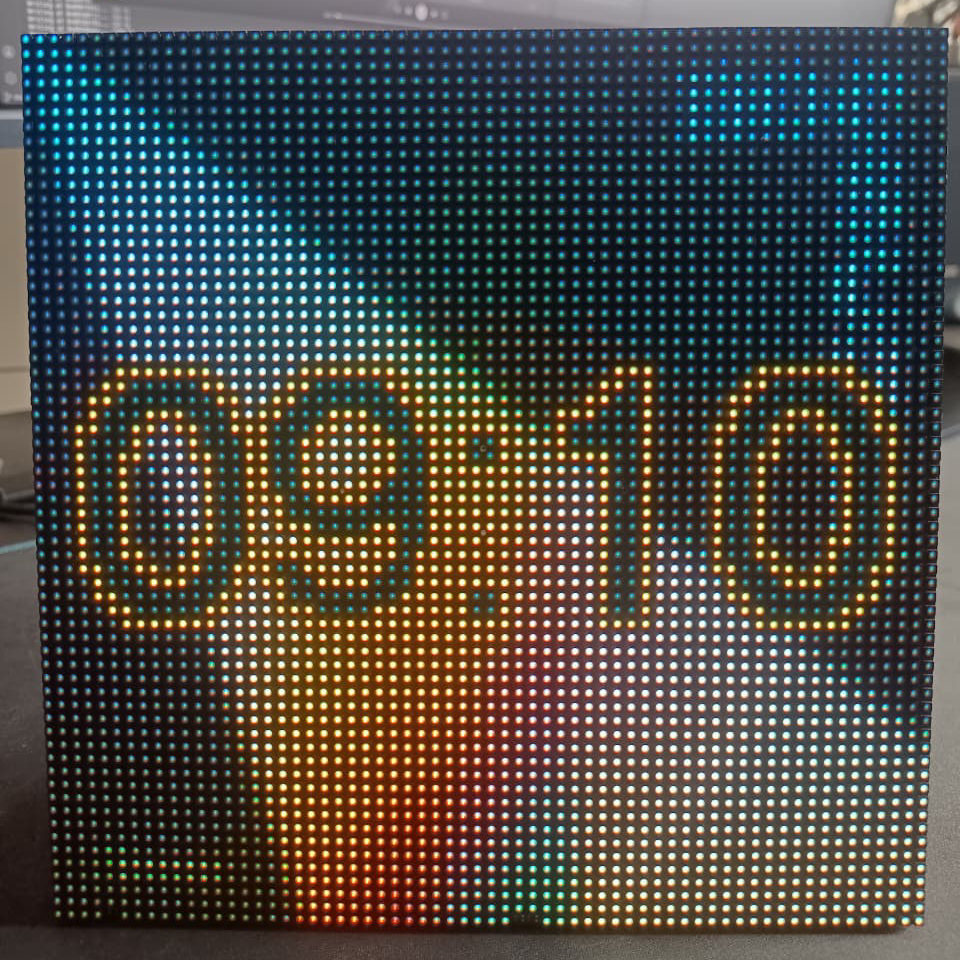
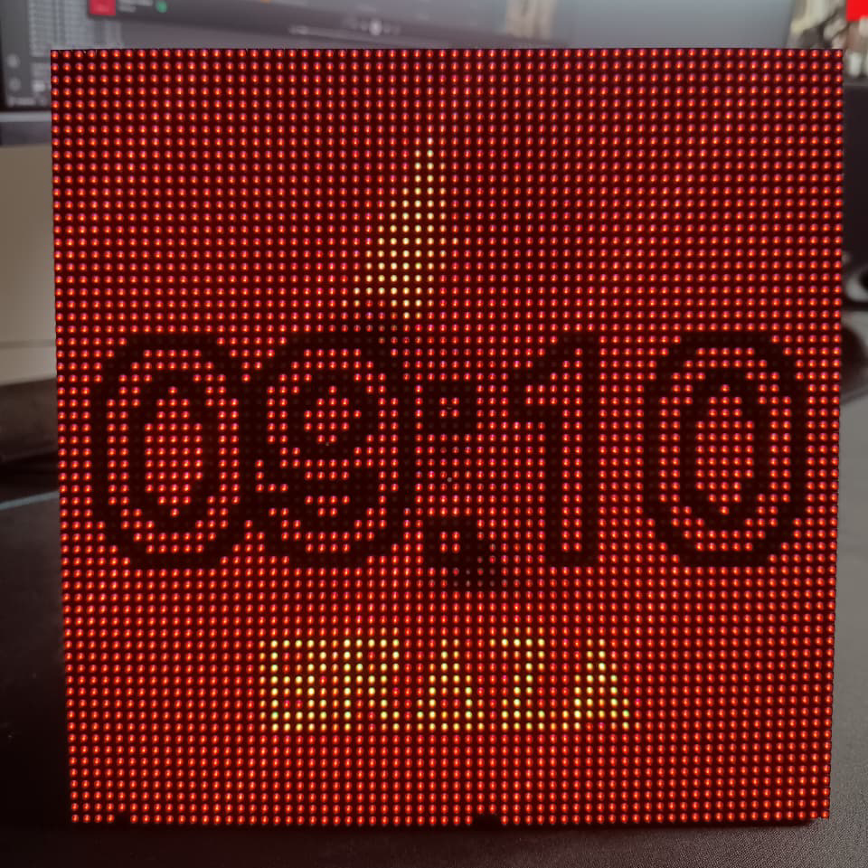
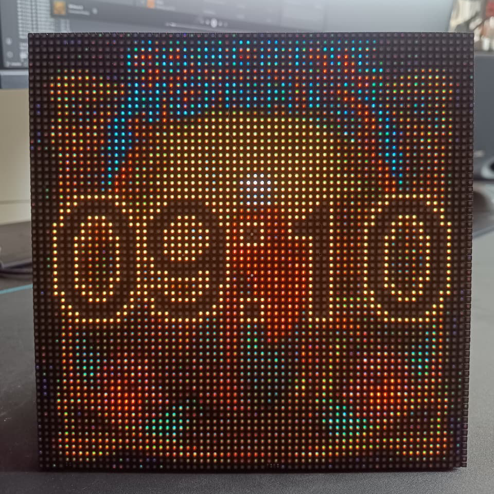
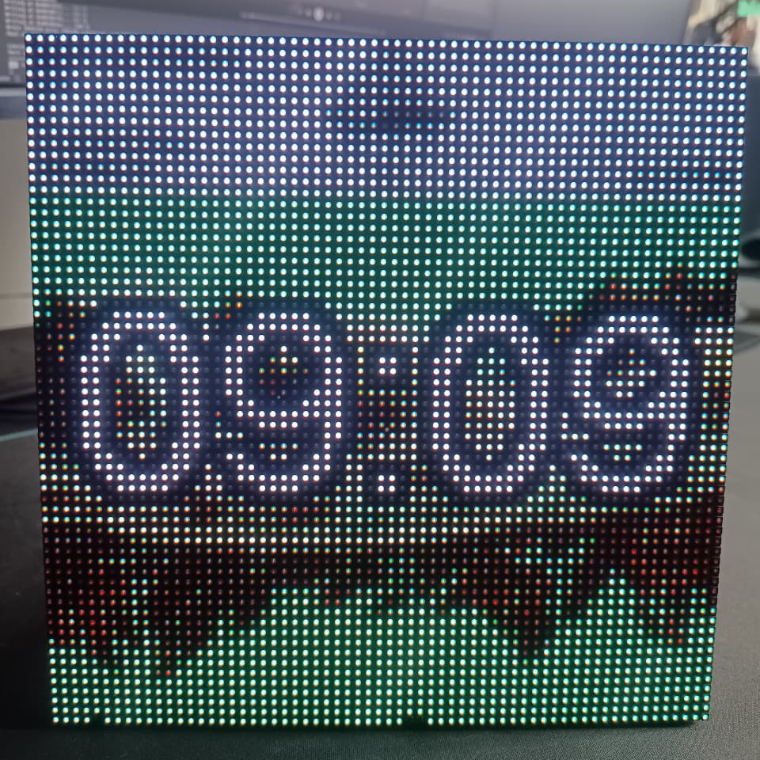

# Spotify Clock MPS3

A real-time display system that shows your currently playing Spotify track on a 64×64 LED matrix, with intelligent color-temperature-aware clock display that adapts to the album artwork.

## Features

- **Now Playing Display**: Shows album art from your currently playing Spotify track in full color on an LED matrix
- **Image-Aware Clock Colors**: Clock colors dynamically adjust based on the dominant colors in the album artwork
- **Predominant Color LED**: The onboard RGB LED of the board displays the predominant color extracted from the album artwork in real-time
- **Time Display**: Shows time with color adjustments based on album artwork and the time of day
- **Idle Display**: When no music is playing, displays the day of the week and current date

## Gallery

This one was connected to a 64x64 3mmm pitch SMD2121 led matrix the I got from [Aliexpress](https://pt.aliexpress.com/item/1005001958513042.html?spm=a2g0o.order_list.order_list_main.212.31facaa4BLPk5P&gatewayAdapt=glo2bra).

### Clock Display


### Album Art Display
<table>
  <tr>
    <td><a href="images/img_1.png" target="_blank"></a></td>
    <td><a href="images/img_2.png" target="_blank"></a></td>
    <td><a href="images/img_3.png" target="_blank"></a></td>
    <td><a href="images/img_4.png" target="_blank"></a></td>
  </tr>
  <tr>
    <td align="center"><a href="https://i.scdn.co/image/ab67616d00001e02d076021191250b5fec6b6c58" target="_blank"></a></td>
    <td align="center"><a href="https://i.scdn.co/image/ab67616d00001e021e0920912a7e005e8f4bae8f" target="_blank"></a></td>
    <td align="center"><a href="https://i.scdn.co/image/ab67616d00001e026c6fb228ad10a71122880a97" target="_blank"></a></td>
    <td align="center"><a href="https://i.scdn.co/image/ab67616d00001e02c2ae4095962f75cdf57750ca" target="_blank"></a></td>
  </tr>
</table>

## Hardware Requirements

**Recommended Board:** [Adafruit Matrix Portal S3](https://www.adafruit.com/product/5778) — An ESP32-S3 based board with built-in HUB75 LED matrix interface and native USB support, designed for internet-connected LED matrix projects.


**Compatible Alternatives:** Any ESP32-S3 microcontroller with enough available GPIO pins (minimum 20+ GPIOs), external PSRAM for color detection and native USB support can work with this project by configuring the pin mapping in `include/config.h`.

### Core Requirements

- **ESP32-S3** microcontroller with **external PSRAM** (required), USB support, and 20+ available GPIO pins
- **HUB75 LED Matrix Driver** (onboard on MatrixPortal, or external daughterboard)
- **64×64 RGB LED Matrix Panel** (HUB75 interface). Standard modules that use normal shift registers are supported; S-PWM is not supported by the library yet.
- WiFi connectivity (built-in to ESP32-S3)

### Pin Configuration (Adafruit MatrixPortal S3)

The project uses the Adafruit MatrixPortal S3 pin mapping for the HUB75 LED matrix driver interface:

```
Color Pins:
  R1: GPIO 42, G1: GPIO 41, B1: GPIO 40
  R2: GPIO 38, G2: GPIO 39, B2: GPIO 37
  
Address Pins:
  A: GPIO 45, B: GPIO 36, C: GPIO 35, D: GPIO 34
  
Control Pins:
  OE: GPIO 33, CLK: GPIO 32, LAT: GPIO 31
```

## Software Dependencies

- PlatformIO
- ESP32-HUB75-MatrixPanel-I2S-DMA
- SpotifyEsp32
- LittleFS (for image caching)
- JPEGDEC (for album art rendering)
- Arduino framework

See `platformio.ini` for the full dependency list.

## Getting Started

### 1. Clone the Repository

```bash
git clone https://github.com/raulzanardo/spotify_clock_mps3.git
cd spotify_clock_mps3
```

### 2. Create Configuration File

Copy the example configuration and fill in your credentials:

```bash
cp include/config.example.h include/config.h
```

### 3. Configure Spotify Credentials

Edit `include/config.h` and add:

- **CLIENT_ID** & **CLIENT_SECRET**: Register your app at [Spotify Developer Dashboard](https://developer.spotify.com/dashboard)
- **REFRESH_TOKEN**: Obtained after first successful authentication (the device will display instructions)
- **WIFI_SSID** & **WIFI_PASS**: Your WiFi network credentials

### 4. Build, Upload & Monitor

Use the PlatformIO buttons in the VS Code extension to build, upload and open the serial monitor (bottom bar / status bar). This provides GUI actions for "Build", "Upload" and "Monitor".

## Configuration Reference

### Network Settings
```cpp
#define WIFI_SSID "Your_Network_Name"
#define WIFI_PASS "Your_Network_Password"
#define PROJECTNAME "spotify_clock_mps3"  // mDNS hostname
```

### Spotify API Credentials
```cpp
#define CLIENT_ID "your_spotify_client_id"
#define CLIENT_SECRET "your_spotify_client_secret"
#define REFRESH_TOKEN "your_spotify_refresh_token"
```
**Note:** Keep these credentials private! Never commit to public repositories.

### Time Settings
```cpp
#define TIME_ZONE "BRT3"              // Timezone (BRT3 = Brasília Time UTC-3)
#define UTC_OFFSET_SECONDS -10800     // UTC offset in seconds
#define ntpServer1 "pool.ntp.org"     // Primary NTP server
#define ntpServer2 "time.nist.gov"    // Fallback NTP server
```
**Common timezone values:** `PST8PDT` (Pacific), `EST5EDT` (Eastern), `CST6CDT` (Central), `GMT0` (UTC), `CET-1CEST` (Central Europe)

### Color Temperature Settings
```cpp
#define CONFIG_NIGHT_START_HOUR 22    // Night begins (0-23 format)
#define CONFIG_NIGHT_END_HOUR 6       // Night ends
#define CONFIG_NIGHT_TEMP 1500.0f     // Color temp at night (Kelvin)
#define CONFIG_MIN_TEMP 2000.0f       // Minimum color temp (warm)
#define CONFIG_MAX_TEMP 6500.0f       // Maximum color temp (cool)
#define CONFIG_NIGHT_DIM_FACTOR 0.3f  // Brightness at night (0.0-1.0)
```

### Pin Configuration (Adafruit MatrixPortal S3 specific)
```cpp
// Color pins
#define PIN_R1 42
#define PIN_G1 41
#define PIN_B1 40
#define PIN_R2 38
#define PIN_G2 39
#define PIN_B2 37

// Address pins
#define PIN_ADDR_A 45
#define PIN_ADDR_B 36
#define PIN_ADDR_C 35
#define PIN_ADDR_D 34
#define PIN_ADDR_E 21

// Control pins
#define PIN_OE 33
#define PIN_CLK 32
#define PIN_LAT 31
```
**For other boards:** Modify these pins to match your hardware connections.

### SpotifyEsp32 Feature Flags
Disable unwanted Spotify API features to reduce memory usage:
```cpp
#define DISABLE_AUDIOBOOKS
#define DISABLE_CATEGORIES
#define DISABLE_CHAPTERS
#define DISABLE_EPISODES
#define DISABLE_GENRES
#define DISABLE_MARKETS
#define DISABLE_PLAYLISTS
#define DISABLE_SEARCH
#define DISABLE_SHOWS
```
Only the essential playback data is fetched by default.

## Color Temperature Algorithm

The clock color shifts throughout the day based on Kelvin temperature:

- **Night (10 PM - 6 AM)**: 1500K warm light, dimmed to 30% brightness
- **Morning (6 AM - 12 PM)**: Gradually increases from 2000K to 6500K
- **Afternoon (12 PM - 6 PM)**: Gradually decreases from 6500K back to 2000K
- **Evening (6 PM - 10 PM)**: Cools down from 2000K toward night temp

This creates a natural, soothing display that adapts to your circadian rhythm.


## Image-Based Color Adaptation

The clock dynamically extracts the dominant colors from the currently playing album artwork and applies them directly to the clock display. This creates a harmonious visual experience where the clock colors perfectly complement the album art being shown.

### Clock Color Extraction Algorithm

The system extracts two colors from the album artwork to ensure optimal readability and aesthetic appeal:

1. **Most Predominant Color**: The most frequently occurring color in the album artwork is extracted and converted to RGB565 format. This color is used for the onboard RGB LED and serves as the primary clock display color.

2. **Least Predominant Color (Contrast Color)**: The least frequently occurring color is initially extracted to provide contrast with the predominant color. This ensures the clock remains readable against the album artwork background.

### Three Possible Color Combinations

The algorithm handles color contrast intelligently with three possible scenarios:

1. **Contrasting Colors Available**: If the most and least predominant colors are sufficiently different (checked against a similarity threshold), they are used as-is. This is the ideal case where natural contrast exists in the artwork.

2. **Similar Colors - Vibrant Fallback**: If the most and least predominant colors are too similar, the algorithm searches for the most vibrant color in the artwork (highest saturation) and uses that as the contrast color instead, providing better visual distinction.

3. **No Suitable Contrast - Color Inversion**: If even the most vibrant color is too similar to the predominant color, the algorithm generates a complementary color by inverting the most predominant color's RGB values. This guarantees maximum contrast while maintaining visual harmony.

This multi-level fallback system ensures the clock is always readable, regardless of the album artwork's color composition.
## File Structure

```
src/main.cpp              # Main firmware code
include/config.h          # User configuration (keep private!)
include/config.example.h  # Configuration template
platformio.ini            # PlatformIO configuration
```

## Performance Notes

- Album art is downloaded and cached in LittleFS (reduces bandwidth)
- Spotify state is checked every 4 seconds
- Clock colors are updated in real-time based on album artwork analysis
- Color temperature calculation is done in integer math where possible

## License

MIT License

Copyright (c) 2025 raulzanardo

Permission is hereby granted, free of charge, to any person obtaining a copy
of this software and associated documentation files (the "Software"), to deal
in the Software without restriction, including without limitation the rights
to use, copy, modify, merge, publish, distribute, sublicense, and/or sell
copies of the Software, and to permit persons to whom the Software is
furnished to do so, subject to the following conditions:

The above copyright notice and this permission notice shall be included in all
copies or substantial portions of the Software.

THE SOFTWARE IS PROVIDED "AS IS", WITHOUT WARRANTY OF ANY KIND, EXPRESS OR
IMPLIED, INCLUDING BUT NOT LIMITED TO THE WARRANTIES OF MERCHANTABILITY,
FITNESS FOR A PARTICULAR PURPOSE AND NONINFRINGEMENT. IN NO EVENT SHALL THE
AUTHORS OR COPYRIGHT HOLDERS BE LIABLE FOR ANY CLAIM, DAMAGES OR OTHER
LIABILITY, WHETHER IN AN ACTION OF CONTRACT, TORT OR OTHERWISE, ARISING FROM,
OUT OF OR IN CONNECTION WITH THE SOFTWARE OR THE USE OR OTHER DEALINGS IN THE
SOFTWARE.

## Contributing

Contributions welcome! Please ensure:
- No secrets are committed (use `include/config.h` locally)
- Code follows existing style (const correctness, USBSerial debugging)
- Changes are tested on real hardware before PR

## Libraries & Resources

### Display & Graphics
- [ESP32-HUB75-MatrixPanel-I2S-DMA](https://github.com/mrfaptastic/ESP32-HUB75-MatrixPanel-I2S-DMA) — HUB75 LED matrix driver library
- [JPEGDEC](https://github.com/bitbank2/JPEGDEC) — JPEG decoder for embedded systems

### API & Connectivity
- [SpotifyEsp32](https://github.com/jetcitycomet/SpotifyEsp32) — Spotify API client library for ESP32

### External APIs
- [Spotify Web API](https://developer.spotify.com/documentation/web-api) — Spotify playback state and metadata

## Inspiration & Credits

**Project inspired by:**
- [64x64 RGB LED Matrix Album Art Display on Pi 3B+](https://www.reddit.com/r/raspberry_pi/comments/ziz4hk/my_64x64_rgb_led_matrix_album_art_display_pi_3b/) — Original concept by the Raspberry Pi community
- [Live Spotify Album Art Display Tutorial](https://learn.sparkfun.com/tutorials/live-spotify-album-art-display/all) — SparkFun's guide to album art displays
- [Tuneshine](https://www.tuneshine.rocks/) - A full product that displays album art from spotify, apple music, sonos and last.fm.

---

### My related projects

- [spotify_clock_wf2](https://github.com/raulzanardo/spotify_clock_wf2) — Another Spotify clock project with different hardware/approach.

---

**Enjoy your Spotify Clock!**
